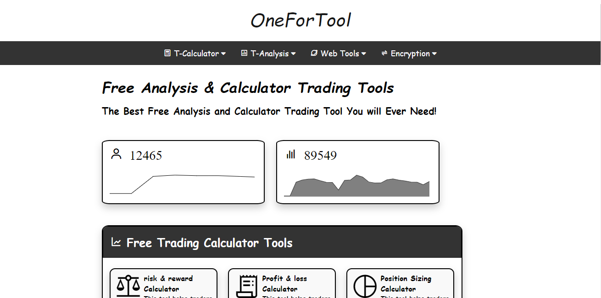

# OneForTool Website

The OneForTool website is a collection of utility tools designed to make various tasks easier. This website is built using only HTML and CSS and provides a range of tools, including Base64 to other base transformations and more.

## Features

- **Base64 to Other Base Transformations**: Convert text or data encoded in Base64 to other bases like binary, octal, or hexadecimal, and vice versa.
- **Tool 2**: Describe the functionality of another tool.
- **Tool 3**: Mention another tool available on the website.
- **Responsive Design**: The website is designed to be responsive, ensuring it works well on various devices.

## How to Use

You can access the OneForTool website and use its tools by following these simple steps:

1. Clone the repository:
  >git clone this repo 
  >cd onefortool-website

2. Open the `index.html` file in your web browser.

3. Choose a tool from the list on the website and follow the instructions provided to perform the desired task.

## Contributing

Contributions to enhance the OneForTool website or add new tools are welcome! If you'd like to contribute, please follow these steps:

1. Fork the repository.
2. Create a new branch for your feature or tool addition.
3. Make your changes, ensuring they follow best practices and maintain the website's style.
4. Submit a pull request, describing the changes and their significance.

## License

This project is licensed under the [MIT License](LICENSE).

## Contact

If you have any questions, feedback, or suggestions regarding the OneForTool website, please feel free to contact us at mohamedaminefki0002@gmail.com .

## Acknowledgments

- Special thanks to the contributors and supporters of the OneForTool project.
- Inspiration for the website design and the collection of tools comes from the need for user-friendly utilities.

